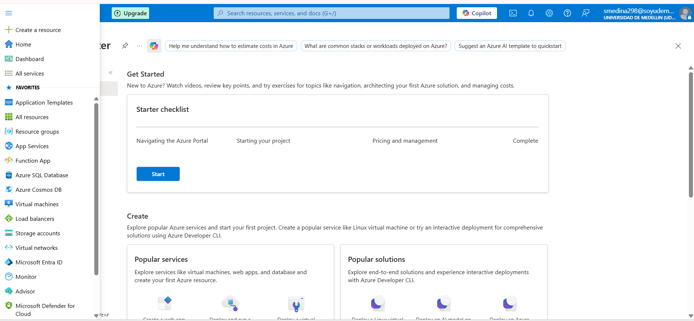
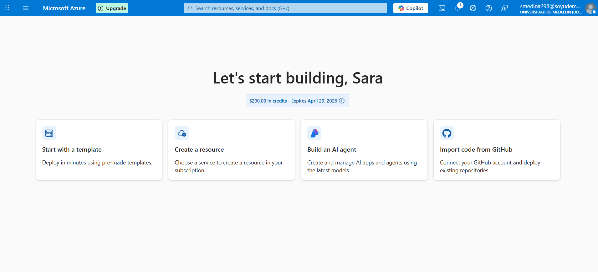
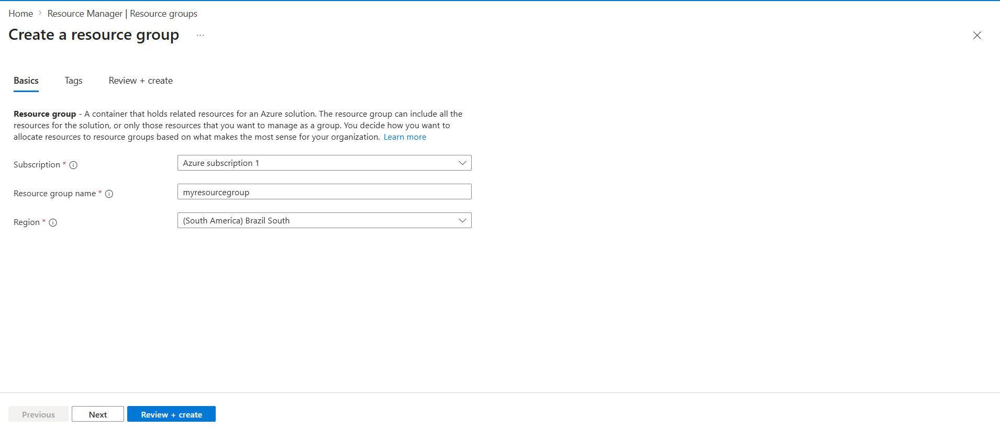

## 👀 First Look at Azure

> **⚠️ Already familiar with Azure?**
> This section introduces the Azure Portal and covers how to create and remove resources.
> If you're comfortable with that already, feel free to **skip to the next section**.
> That said, a quick refresh never hurts. 😉

---
## 🖥️ Azure Portal — First Look

The Azure Portal (portal.azure.com) is the main web interface to manage 
all Azure resources. It provides a visual, point-and-click experience for 
creating, configuring, and monitoring cloud services.

### 📌 Key Elements of the Portal

| Element | Description |
|---|---|
| **+ Create a resource** | Entry point to provision any Azure service |
| **Home** | Dashboard with quick access and recommendations |
| **All resources** | Complete list of everything deployed in your subscription |
| **Resource groups** | Logical containers to organize related resources |
| **Monitor** | Centralized observability — metrics, logs, alerts |
| **Microsoft Entra ID** | Identity and access management (users, roles, permissions) |

> 📸 *Screenshot: Azure Portal Home view*
> 

## 🆓 Azure Free Account

Azure offers a **free trial** with $200 USD in credits (valid for 30 days),
giving full access to all Azure services to explore and build.

> 📸 *Screenshot: Azure Portal Home view*
> 

### Quick Actions available from the start

| Action | Description |
|---|---|
| **Start with a template** | Deploy pre-made solutions in minutes |
| **Create a resource** | Manually provision any Azure service |
| **Build an AI agent** | Create AI-powered apps using Azure AI models |
| **Import code from GitHub** | Connect a repo and deploy directly to Azure |

> 💡 **Tip:** For this course, **"Create a resource"** will be the most used 
> option — it's where you provision IoT Hub and all related services.

## 📦 Resource Groups

A **Resource Group** is a logical container that holds related Azure resources 
for a solution. It helps you organize, manage, and delete resources together.

> Think of it as a **project folder** in the cloud — everything related to 
> one solution lives inside the same group.

### Key concepts

| Field | Description |
|---|---|
| **Subscription** | The billing account associated with the resources |
| **Resource group name** | A unique identifier for the container |
| **Region** | Where the metadata of the group is stored |

> ⚠️ The region of the resource group doesn't force resources inside it 
> to be in the same region — each resource can be deployed independently.

---

### 🥇 First resource created: `myresourcegroup`

| Setting | Value |
|---|---|
| Subscription | Azure subscription 1 |
| Region | (South America) Brazil South |

> 💡 **Why Brazil South?** It's the closest Azure region to Colombia, 
> which means lower latency for local projects.

> 

---

### ✅ Best practices for naming resource groups

- Use descriptive names: `rg-iot-livestock-dev`, `rg-iot-course-labs`
- Include the environment: `-dev`, `-prod`, `-test`
- One resource group per lab or project — makes cleanup easy

> 🗑️ **Tip:** When you finish a lab, deleting the resource group 
> deletes **everything inside it** in one click — saving credits.

## 🧱 Azure Basic Concepts

> **⚠️ Already familiar with Azure basics?**
> This section covers foundational concepts: Resource Groups, Regions, 
> Storage Accounts, and more.
> Feel free to **skip to the next section** if you know these well —
> but a quick refresh never hurts. 😉

---
# 🧱 Azure Basic Concepts

> **⚠️ Already familiar with Azure basics?**  
> This section covers: Regions, Resource Groups, Storage Accounts, SLA, Cost and Budgets.  
> Feel free to **skip to the next section** if you know these well — but a quick refresh never hurts. 😉

---

## 🗺️ Regions

Almost every resource in Azure must be placed in a **Region** — the geographic 
location of the datacenter where your resource will live.

### How to select a Region?

| Criteria | Description |
|---|---|
| 📍 **Proximity** | Choose the region closest to your users for lower latency |
| ✅ **Service availability** | Not all services are available in every region — always verify at [azure.microsoft.com/en-us/global-infrastructure/services](https://azure.microsoft.com/en-us/global-infrastructure/services/) |
| 🏗️ **Availability Zones** | Some regions have multiple physical datacenters for higher availability |
| 💰 **Pricing** | The same service can have different prices across regions |

> 💡 **Example:** The same VM (D2 v3, Windows) costs ~$192/month in Norway West 
> but only ~$152/month in West US — same specs, different region, 20% cheaper.

---

## 📦 Resource Groups

A **Resource Group** is a free logical container that groups related Azure resources.

- Almost every resource in Azure must belong to a Resource Group
- Used to organize resources by project, environment, or team
- Deleting a Resource Group deletes **all resources inside it**

### Azure Hierarchy
---

## 💾 Storage Account

A **Storage Account** is used to store almost anything in Azure.

- Used transparently by many Azure services (backups, VM disks, diagnostics)
- Also available for explicit data storage (files, blobs, tables, queues)
- Very cost-effective

> We'll explore Storage Accounts in depth in a later module.

---

## 📊 SLA — Service Level Agreement

The **SLA** defines the guaranteed uptime percentage of a cloud service.

| SLA (%) | Yearly Downtime Allowed |
|---|---|
| 95% | 18d 6h 17m 27s |
| 99% | 3d 15h 39m 29s |
| 99.9% | 8h 45m 56s |
| 99.99% | 52m 35s |

> ⚠️ **Always check the SLA** of every service you use.  
> Free and Shared tiers usually have **no SLA**.

### SLA Calculation

When your system uses multiple services, multiply their SLAs to get the 
**actual system SLA**:
### 🧮 SLA Calculator

A simple tool to calculate downtime from any SLA percentage:  
🔗 [uptime.is](https://uptime.is/)

---

## 💰 Cost

Almost everything in the cloud costs money. Azure uses three main pricing models:

| Model | Description | Example |
|---|---|---|
| **Per resource** | Fixed cost for provisioned resource | Virtual Machines |
| **Per consumption** | Pay only for what is used | Function Apps |
| **Reservations** | Commit 1–3 years for up to ~57% discount | VMs, SQL |

> ✅ **Best practices:**
> - Always check cost **before** provisioning
> - Look for more cost-effective alternatives
> - Use reservations for stable, long-running workloads

### 🧮 Azure Pricing Calculator

Estimate costs before deploying anything:  
🔗 [azure.microsoft.com/en-us/pricing/calculator](https://azure.microsoft.com/en-us/pricing/calculator/)

---

## 🎯 Setting a Budget

> *(Lab: Configure a budget alert in Azure Cost Management)*

To avoid unexpected charges during the course, it's highly recommended to 
set a **spending budget with alerts** in your subscription.

**Steps:**  
`Azure Portal` → `Cost Management` → `Budgets` → `+ Add`

> 💡 **Tip for this course:** Set an alert at 50% and 80% of your $200 credit 
> so you never run out unexpectedly before finishing the labs.